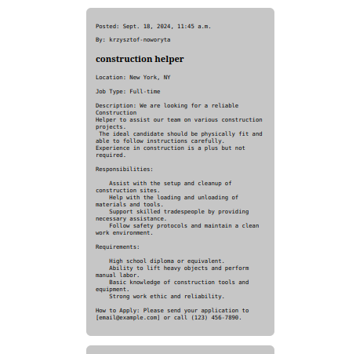
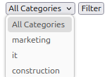
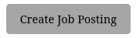

# Home page elements:

### Job list - where user can view posted jobs

Every job posting contains:

+ publication date
+ author of the job advertisement
+ title
+ content of advertisement

### Filter

Filter allows user to filter job postings by category.

### Create job posting button

Button that when clicked takes user to page where he can create posting
